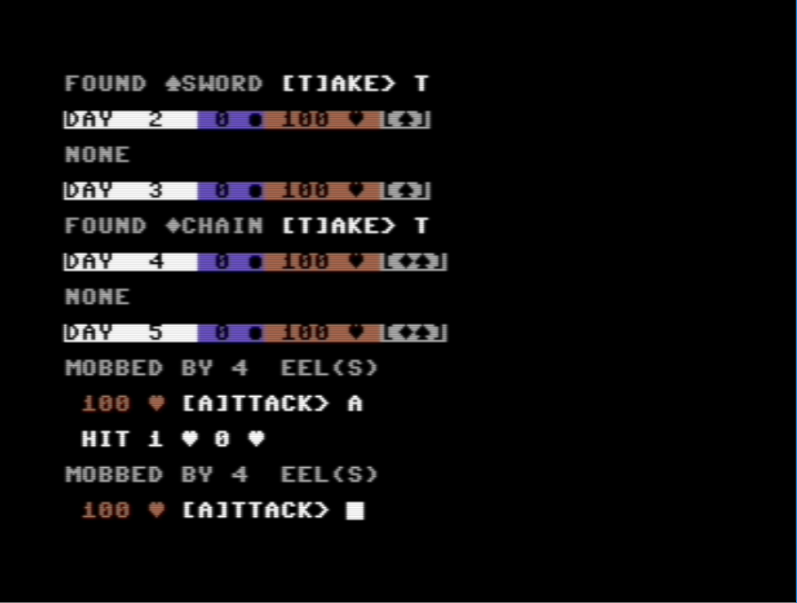

# MINIRPG

**MINIRPG** is a turn-based role play game for [COMMODORE 64](https://it.wikipedia.org/wiki/Commodore_64) home computer, with **unlimited different timelines**. 

In this game, the player assumes the role of a protagonist in a 15 days long exploration of a forest. In this period, he / she will be able to collect and use [weapons](/docs/weapons.md) and [armors](/docs/armors.md), and fight [monsters](/docs/monsters.md), all to gain experience points.

This game is designed for a single player, it is text-based and it uses procedural generation to create and store all timelines, in order to be able to play again with them, **without use of external storage**.

[Click here](/docs/instructions.md) to read the instructions on how to play, and [here](https://github.com/spotlessmind1975/adv10en/blob/master/minirpg-all.d64) to download the disk image (D64 format). 
The image contains both English and [Italian edition](https://github.com/spotlessmind1975/minigdr).

This game was created to participate in the ["BASIC10Liner" competition 2020](https://gkanold.wixsite.com/homeputerium/2020). For this reason, the game is modest in size, the given source code respects strong constraints on the length of each line (category: **PUR-120**) and it does not rely on third party libraries. 

For those wishing to deepen the details of its implementation, please refer to the following documents:
 *  [the source code](/docs/source.md)
 *  [the procedural generator](/docs/procedural-generator.md)
 *  [the random tape](/docs/random-tape.md)