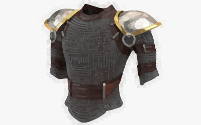
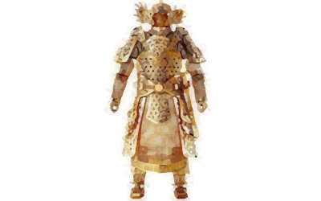
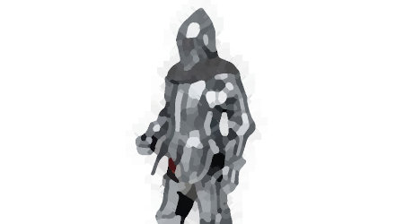
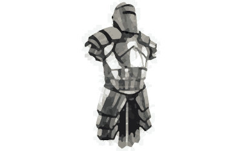
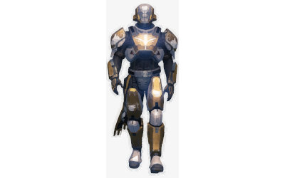

# ARMORS

In your wandering through the forest, you will most likely be attacked by animals and monsters. For this reason it is important to be protected, and the armor has this purpose.  During the exploration of the forest, you will be able to find armors left by previous characters: however, you can always and only take an armor. **Once taken, you will not be able to change the armor.** So choose it well.

## ARMOR CLASS

Each armor is characterized by a resistance to knocks and attacks, called "armor class" (AC), which is indicated by a number. The higher this number, the greater the protection you will receive.

When you decide to attack a monster, it could hit you, potentially causing you a number of hit points: however, if the suffered hit points are **less** than the armor class, then the hit will be "absorbed" by the armor and **you will not take any damage**.

In a nutshell, this is the list of armors that can be found and the relative resistance score:

<table>
    <tr>
        <th>ARMOR</th>
        <th>Armour Class (AC)</th>
    </tr>
    <tr>
        <td>CHAIN MAIL</td>
        <td>3</td>
    </tr>
    <tr>
        <td>PLATE ARMOR</td>
        <td>6</td>
    </tr>
    <tr>
        <td>METAL ARMOR</td>
        <td>9</td>
    </tr>
    <tr>
        <td>GOLD ARMOR</td>
        <td>12</td>
    </tr>
    <tr>
        <td>TITAN ARMOR</td>
        <td>15</td>
    </tr>
</table>

## LIST OF ARMORS

### CHAIN MAIL

Mail (also falsely "maille", "chain mail(le)" or "chainmail(le)") is a type of armour consisting of small metal rings linked together in a pattern to form a mesh. A coat of this armour is often referred to as a hauberk, and sometimes a byrnie.

*This article uses material from the Wikipedia article <a href="https://en.wikipedia.org/wiki/Chain_mail">Chain mail</a>, which is released under the <a href="https://creativecommons.org/licenses/by-sa/3.0/">Creative Commons Attribution-Share-Alike License 3.0</a>.*

<table>
    <tr>
        <th>
        Armour Class (AC)
        </th>
        <td>3</td>
    </tr>
</table>

### GOLD ARMOR

A golden armor created from a variety of golden elaborated pieces put on a metal armor. The helmet looks like a japanese old armor.

<table>
    <tr>
        <th>
        Armour Class (AC)
        </th>
        <td>12</td>
    </tr>
</table>

### METAL ARMOR

A craft metal armor created from a variety of scrap pieces put on a black leather armor. The helmet looks like a closedfaced, armor-plated motorcycle helmet.

<table>
    <tr>
        <th>
        Armour Class (AC)
        </th>
        <td>9</td>
    </tr>
</table>

### PLATE ARMOR

Plate armour is a historical type of personal body armour made from iron or steel plates, culminating in the iconic suit of armour entirely encasing the wearer. 

<table>
    <tr>
        <th>
        Armour Class (AC)
        </th>
        <td>6</td>
    </tr>
</table>

*This article uses material from the Wikipedia article <a href="https://en.wikipedia.org/wiki/Plate_armour">Plate Armour</a>, which is released under the <a href="https://creativecommons.org/licenses/by-sa/3.0/">Creative Commons Attribution-Share-Alike License 3.0</a>.*

### TITAN ARMOR

A sort of "magic" armor. It is really hard to defeat.

<table>
    <tr>
        <th>
        Armour Class (AC)
        </th>
        <td>15</td>
    </tr>
</table>

