# MONSTERS

In this game the forest is not uninhabited at all. There are many animals and monsters that infest it, and you will be called to explore it, meet them and fight with them. Some of these are small and harmless, others are dangerous; some move alone, others in packs. On this page you will find a series of useful information that will allow you to choose the best strategy to defeat them (or to survive!).

## SIZES

Over the course of evolution, different breeds of animals, monsters and magical beings have come to form. In some parts of the forest, being small meant having a competitive advantage in hiding; in others, "size matters". For this reason, for each type of monster there are different sizes:

<table>
    <tr>
        <th>
        Size 
        </th>
        <th>Multiplicative factor (HP/XP)</th>
    </tr>
    <tr>
        <td>toy</td>
        <td>x 1</td>
    </tr>
    <tr>
        <td>"common"</td>
        <td>x 2</td>
    </tr>
    <tr>
        <td>huge</td>
        <td>x 3</td>
    </tr>
</table>

## LIST OF KNOWN MONSTERS

### APES

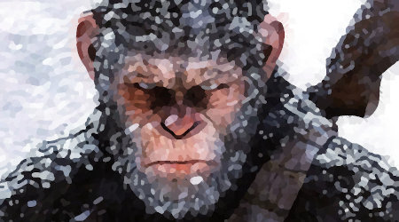

"Smart and fierce". These are the characteristics of the bees that inhabit this forest. Major studies of behaviour in the field have shown that in their natural environments, the non-human hominoids show sharply varying social structure: monogamous, territorial pair-bonders, solitary, the apes live in small troops with a single adult male leader. All apes are generally thought of as highly intelligent, and  they perform very well on a wide range of cognitive tests.

*This article uses material from the Wikipedia article <a href="https://en.wikipedia.org/wiki/Ape">Ape</a>, which is released under the <a href="https://creativecommons.org/licenses/by-sa/3.0/">Creative Commons Attribution-Share-Alike License 3.0</a>.*

<table>
    <tr>
        <th>
        Size 
        </th>
        <th>Life (HP/XP)</th>
        <th>Attack (HP)</th>
    </tr>
    <tr>
        <td>toy</td>
        <td>9</td>
        <td>1-9 / hit (little rocks)</td>
    </tr>
    <tr>
        <td>"common"</td>
        <td>18</td>
        <td>2-18 / hit (little branches)</td>
    </tr>
    <tr>
        <td>huge</td>
        <td>27</td>
        <td>3-27 / hit (big branches)</td>
    </tr>
</table>

### BATS

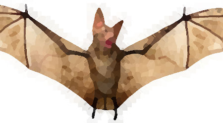

Bats are mammals of the order Chiroptera; with their forelimbs adapted as wings, they are the only mammals capable of true and sustained flight. Bats are more manoeuvrable than birds, flying with their very long spread-out digits covered with a thin membrane or patagium. Most bats are nocturnal, and many roost in caves or other refuges

*This article uses material from the Wikipedia article <a href="https://en.wikipedia.org/wiki/Bat">Bat</a>, which is released under the <a href="https://creativecommons.org/licenses/by-sa/3.0/">Creative Commons Attribution-Share-Alike License 3.0</a>.*

<table>
    <tr>
        <th>
        Size 
        </th>
        <th>Life (HP/XP)</th>
        <th>Attack (HP)</th>
    </tr>
    <tr>
        <td>toy</td>
        <td>6</td>
        <td>1-6 / hit (little fangs)</td>
    </tr>
    <tr>
        <td>"common"</td>
        <td>12</td>
        <td>2-12 / hit (little fangs)</td>
    </tr>
    <tr>
        <td>huge</td>
        <td>18</td>
        <td>3-18 / hit (fangs)</td>
    </tr>
</table>

### BOAS

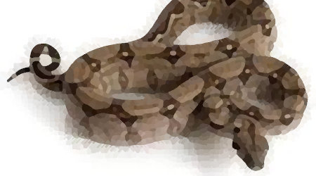

The boa, also called the red-tailed boa or the common boa, is a species of large, non-venomous, heavy-bodied snake that is frequently kept and bred in captivity. The boa constrictor is a member of the family Boidae, found in tropical North, Central, and South America, as well as some islands in the Caribbean. Boa constrictors are ambush predators, so often lie in wait for an appropriate prey to come along, when they attack. However, they have also been known to actively hunt, particularly in regions with a low concentration of suitable prey, and this behavior generally occurs at night. The boa first strikes at the prey, grabbing it with its teeth; it then proceeds to constrict the prey until death before consuming it whole.

*This article uses material from the Wikipedia article <a href="https://en.wikipedia.org/wiki/Boa_constrictor">Boa constrictor</a>, which is released under the <a href="https://creativecommons.org/licenses/by-sa/3.0/">Creative Commons Attribution-Share-Alike License 3.0</a>.*

<table>
    <tr>
        <th>
        Size (*)
        </th>
        <th>Life (HP/XP)</th>
        <th>Attack (HP)</th>
    </tr>
    <tr>
        <td>dwarfed/toy</td>
        <td>10</td>
        <td>1-10 / hit (teeth)</td>
    </tr>
    <tr>
        <td>"common"</td>
        <td>20</td>
        <td>2-20 / hit (teeth)</td>
    </tr>
    <tr>
        <td>huge</td>
        <td>30</td>
        <td>3-30 / hit (teeth)</td>
    </tr>
</table>

**(*)** = there are three types of elf genres, of different sizes

### (FERAL) CATS

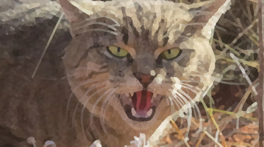

A feral cat is an un-owned domestic cat that lives outdoors and avoids human contact: it does not allow itself to be handled or touched, and usually remains hidden from humans. Feral cats may breed over dozens of generations and become an aggressive apex predator. Feral cats may live outdoors in colonies.

*This article uses material from the Wikipedia article <a href="https://en.wikipedia.org/wiki/Feral_cat">Feral cat</a>, which is released under the <a href="https://creativecommons.org/licenses/by-sa/3.0/">Creative Commons Attribution-Share-Alike License 3.0</a>.*

<table>
    <tr>
        <th>
        Size 
        </th>
        <th>Life (HP/XP)</th>
        <th>Attack (HP)</th>
    </tr>
    <tr>
        <td>toy</td>
        <td>1</td>
        <td>1 / hit (nails)</td>
    </tr>
    <tr>
        <td>"common"</td>
        <td>2</td>
        <td>2 / hit (nails)</td>
    </tr>
    <tr>
        <td>huge</td>
        <td>3</td>
        <td>3 / hit (nails)</td>
    </tr>
</table>

### (WILD) DOGS

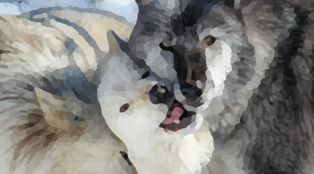

Wild dog, also known as the gray wolf or grey wolf, is a large canine. The wild dog is nonetheless closely related enough to smaller Canis species, such as the coyote and the golden jackal, to produce fertile hybrids with them. The winter fur of a wild dog is long and bushy and predominantly mottled gray, although nearly pure white, red and brown to black colours also occur.

*This article uses material from the Wikipedia article <a href="https://en.wikipedia.org/wiki/Wolf">Wolf</a>, which is released under the <a href="https://creativecommons.org/licenses/by-sa/3.0/">Creative Commons Attribution-Share-Alike License 3.0</a>.*

<table>
    <tr>
        <th>
        Size 
        </th>
        <th>Life (HP/XP)</th>
        <th>Attack (HP)</th>
    </tr>
    <tr>
        <td>toy</td>
        <td>4</td>
        <td>1-4 / hit (fangs)</td>
    </tr>
    <tr>
        <td>"common"</td>
        <td>8</td>
        <td>2-8 / hit (fangs)</td>
    </tr>
    <tr>
        <td>huge</td>
        <td>12</td>
        <td>3-12 / hit (fangs)</td>
    </tr>
</table>

### EELS

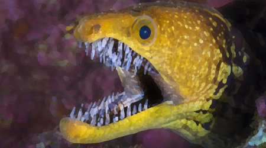

An eel is any ray-finned fish belonging to the order Anguilliformes. Eels undergo considerable development from the early larval stage to the eventual adult stage, and most are predators. Most eels live in the shallow waters of the ocean and burrow into sand, mud, or amongst rocks. A majority of eel species are nocturnal, thus are rarely seen. Sometimes, they are seen living together in holes, or "eel pits".

*This article uses material from the Wikipedia article <a href="https://en.wikipedia.org/wiki/Eel">Eel</a>, which is released under the <a href="https://creativecommons.org/licenses/by-sa/3.0/">Creative Commons Attribution-Share-Alike License 3.0</a>.*

<table>
    <tr>
        <th>
        Size 
        </th>
        <th>Life (HP/XP)</th>
        <th>Attack (HP)</th>
    </tr>
    <tr>
        <td>toy</td>
        <td>5</td>
        <td>1-5 / hit (small fangs)</td>
    </tr>
    <tr>
        <td>"common"</td>
        <td>10</td>
        <td>2-10 / hit (fangs)</td>
    </tr>
    <tr>
        <td>huge</td>
        <td>15</td>
        <td>3-15 / hit (electric shock)</td>
    </tr>
</table>

### ELKS

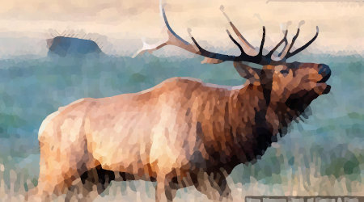

The elk or wapiti (Cervus canadensis) is one of the largest species within the deer family, Cervidae, and one of the largest terrestrial mammals. This animal should not be confused with the still larger Alces alces, known as the moose in America, but as the "elk" in British English and in reference to populations in Eurasia.

Elk range in forest and forest-edge habitat, feeding on grasses, plants, leaves, and bark. Male elk have large antlers which are shed each year. Males also engage in ritualized mating behaviors during the rut, including posturing, antler wrestling (sparring), and bugling, a loud series of vocalizations that establishes dominance over other males and attracts females.

*This article uses material from the Wikipedia article <a href="https://en.wikipedia.org/wiki/Elk">Elk</a>, which is released under the <a href="https://creativecommons.org/licenses/by-sa/3.0/">Creative Commons Attribution-Share-Alike License 3.0</a>.*

<table>
    <tr>
        <th>
        Size 
        </th>
        <th>Life (HP/XP)</th>
        <th>Attack (HP)</th>
    </tr>
    <tr>
        <td>toy</td>
        <td>12</td>
        <td>1-12 / hit (corns attack)</td>
    </tr>
    <tr>
        <td>"common"</td>
        <td>24</td>
        <td>2-24 / hit (corns attack)</td>
    </tr>
    <tr>
        <td>huge</td>
        <td>36</td>
        <td>3-36 / hit (corns attack)</td>
    </tr>
</table>

### HAGS

A hag is a wizened old woman, or a kind of fairy or goddess having the appearance of such a woman, often found in folklore and children's tales such as Hansel and Gretel. Hags are often seen as malevolent, but may also be one of the chosen forms of shapeshifting deities, such as the Morrígan or Badb, who are seen as neither wholly benevolent nor malevolent.

His weapon is the magic wand, which can inflict significant damage even with the movement of air. Unfortunately, even if a hag is defeated, it is not possible to take the hag, because its magical force is linked to the life of the hag.

*This article uses material from the Wikipedia article <a href="https://en.wikipedia.org/wiki/Chain_mail">Chain mail</a>, which is released under the <a href="https://creativecommons.org/licenses/by-sa/3.0/">Creative Commons Attribution-Share-Alike License 3.0</a>.*

<table>
    <tr>
        <th>
        Size (*)
        </th>
        <th>Life (HP/XP)</th>
        <th>Attack (HP)</th>
    </tr>
    <tr>
        <td>dwarfed/toy</td>
        <td>14</td>
        <td>1-14 / hit (magic wand)</td>
    </tr>
    <tr>
        <td>"common"</td>
        <td>28</td>
        <td>2-28 / hit (magic wand)</td>
    </tr>
    <tr>
        <td>giant/huge</td>
        <td>42</td>
        <td>3-42 / hit (magic wand)</td>
    </tr>
</table>

**(*)** = hag can be the object of magical practices, which diminish their stature

### HOGS

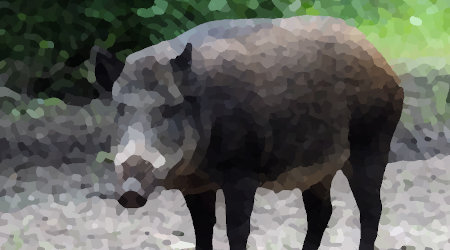

The hog (Porcula salvania) is an endangered suid, previously spread across Bhutan, India and Nepal, but now only found in India (Assam).  In the wild, they make small nests by digging a small trench and lining it with vegetation. During the heat of the day, they stay within these nests. They feed on roots, tubers, insects, rodents, and small reptiles.

*This article uses material from the Wikipedia article <a href="https://en.wikipedia.org/wiki/Pygmy_hog">Pygmy hog</a>, which is released under the <a href="https://creativecommons.org/licenses/by-sa/3.0/">Creative Commons Attribution-Share-Alike License 3.0</a>.*

<table>
    <tr>
        <th>
        Size 
        </th>
        <th>Life (HP/XP)</th>
        <th>Attack (HP)</th>
    </tr>
    <tr>
        <td>toy</td>
        <td>11</td>
        <td>1-11 / hit (fangs attack)</td>
    </tr>
    <tr>
        <td>"common"</td>
        <td>22</td>
        <td>2-22 / hit (fangs attack)</td>
    </tr>
    <tr>
        <td>huge</td>
        <td>33</td>
        <td>3-33 / hit (fangs attack)</td>
    </tr>
</table>

### ORCS

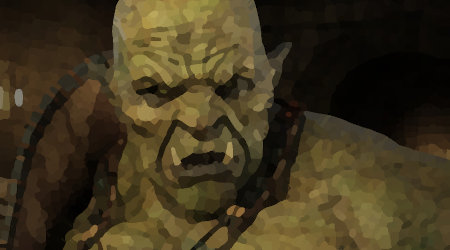

Orcs are of human shape, of varying size. They are depicted as ugly and filthy, with a taste for human flesh. They are fanged, bow-legged and long-armed and some have dark skin as if burne. Orcs eat meat, including the flesh of Men, and may indulge in cannibalism.

*This article uses material from the Wikipedia article <a href="https://en.wikipedia.org/wiki/Orc">Orc</a>, which is released under the <a href="https://creativecommons.org/licenses/by-sa/3.0/">Creative Commons Attribution-Share-Alike License 3.0</a>.*

<table>
    <tr>
        <th>
        Size 
        </th>
        <th>Life (HP/XP)</th>
        <th>Attack (HP)</th>
    </tr>
    <tr>
        <td>toy</td>
        <td>7</td>
        <td>1-7 / hit (weapon)</td>
    </tr>
    <tr>
        <td>"common"</td>
        <td>14</td>
        <td>2-14 / hit (weapon)</td>
    </tr>
    <tr>
        <td>huge</td>
        <td>21</td>
        <td>3-21 / hit (weapon)</td>
    </tr>
</table>

### OWLS

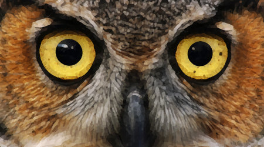

Owls are birds from the order Strigiformes. They are mostly solitary and nocturnal birds of prey typified by an upright stance, a large, broad head, binocular vision, binaural hearing, sharp talons, and feathers adapted for silent flight.

*This article uses material from the Wikipedia article <a href="https://en.wikipedia.org/wiki/Owl">Owl</a>, which is released under the <a href="https://creativecommons.org/licenses/by-sa/3.0/">Creative Commons Attribution-Share-Alike License 3.0</a>.*

<table>
    <tr>
        <th>
        Size 
        </th>
        <th>Life (HP/XP)</th>
        <th>Attack (HP)</th>
    </tr>
    <tr>
        <td>toy</td>
        <td>3</td>
        <td>1-3 / hit (nails)</td>
    </tr>
    <tr>
        <td>"common"</td>
        <td>6</td>
        <td>2-6 / hit (nails)</td>
    </tr>
    <tr>
        <td>huge</td>
        <td>9</td>
        <td>3-9 / hit (nails)</td>
    </tr>
</table>

### RATS
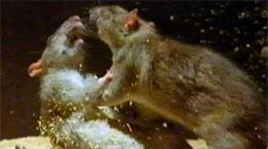

Rats are various medium-sized, long-tailed rodents. Species of rats are found throughout the order Rodentia, but stereotypical rats are found in the genus Rattus. Other rat genera include Neotoma (pack rats), Bandicota (bandicoot rats) and Dipodomys (kangaroo rats).

*This article uses material from the Wikipedia article <a href="https://en.wikipedia.org/wiki/Rat">Rat</a>, which is released under the <a href="https://creativecommons.org/licenses/by-sa/3.0/">Creative Commons Attribution-Share-Alike License 3.0</a>.*

<table>
    <tr>
        <th>
        Size 
        </th>
        <th>Life (HP/XP)</th>
        <th>Attack (HP)</th>
    </tr>
    <tr>
        <td>toy</td>
        <td>2</td>
        <td>1-2 / hit (bit)</td>
    </tr>
    <tr>
        <td>"common"</td>
        <td>4</td>
        <td>2-4 / hit (bit)</td>
    </tr>
    <tr>
        <td>huge</td>
        <td>6</td>
        <td>3-6 / hit (bit)</td>
    </tr>
</table>

### ROCS

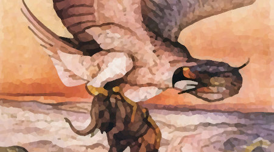

The Roc is an enormous legendary bird of prey in the popular mythology of the Middle East.

It appears in Arabic geographies and natural history, popularized in Arabian fairy tales and sailors' folklore. Ibn Battuta tells of a mountain hovering in the air over the China Seas, which was the Roc. The story collection One Thousand and One Nights includes tales of Abd al-Rahman and Sinbad the Sailor, both of which include the Roc.

*This article uses material from the Wikipedia article <a href="https://en.wikipedia.org/wiki/Roc_(mythology)">Roc (mithology)</a>, which is released under the <a href="https://creativecommons.org/licenses/by-sa/3.0/">Creative Commons Attribution-Share-Alike License 3.0</a>.*

<table>
    <tr>
        <th>
        Size 
        </th>
        <th>Life (HP/XP)</th>
        <th>Attack (HP)</th>
    </tr>
    <tr>
        <td>toy</td>
        <td>13</td>
        <td>1-13 / hit (beak)</td>
    </tr>
    <tr>
        <td>"common"</td>
        <td>26</td>
        <td>2-26 / hit (beak)</td>
    </tr>
    <tr>
        <td>huge</td>
        <td>39</td>
        <td>3-39 / hit (beak)</td>
    </tr>
</table>