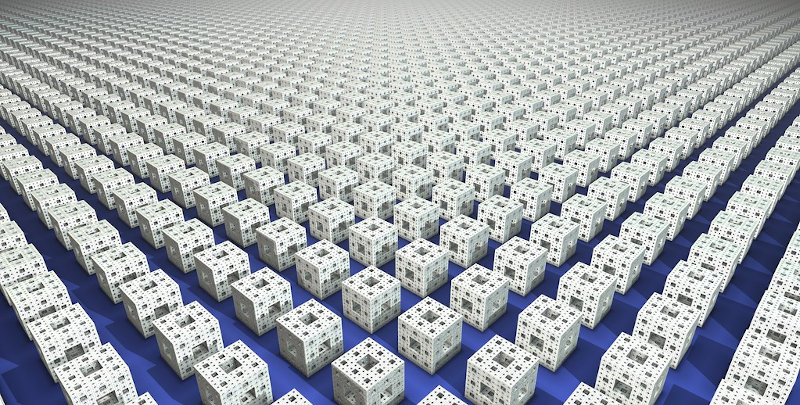
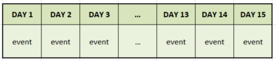
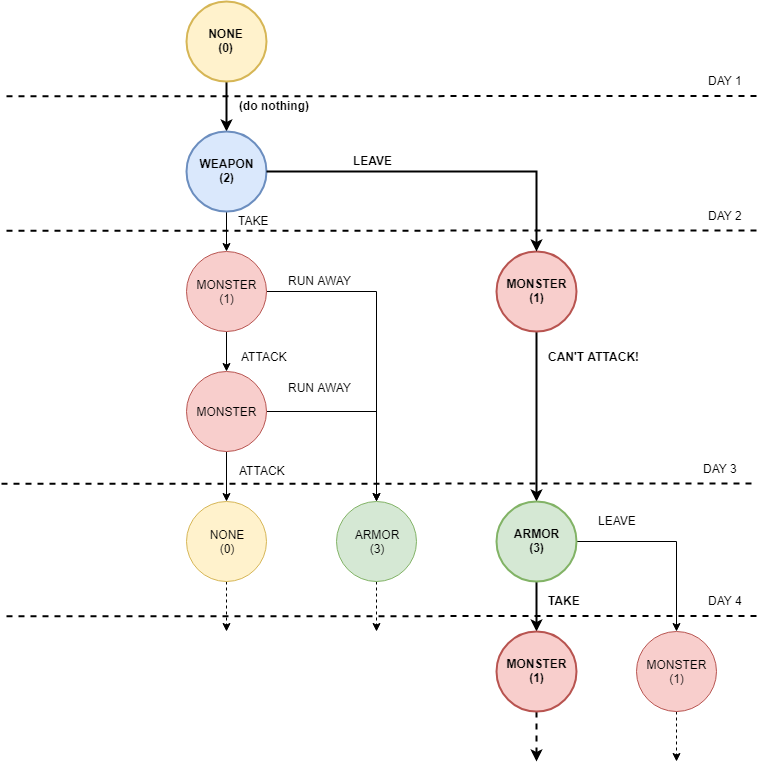
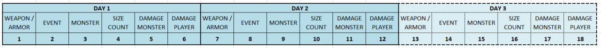
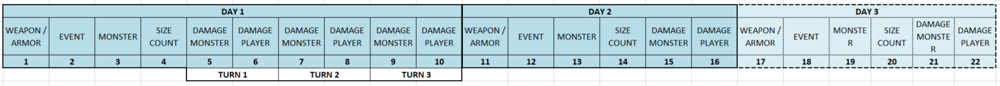

# PROCEDURAL GENERATOR

## WHAT IS THE "PROCEDURAL GENERATION"?

When designing the content of a game, especially in those that need a map or something like that, a certain amount of storage space and programming time is used in creating the content that the game will use. Although the approach of using human creativity is unmatched, however, **this approach is often unusable on computers that have few memory and computing resources** (as the 8 bit retrocomputers have).

For this reason it is possible to imagine replacing this creative process with an algorithmic generative process. So, **the "procedural generation" is a method of creating data algorithmically** rather than manually, avoiding storing unnecessary data. It exploits the combination of resources and man-generated algorithms associated with elements of randomness. The benefits of procedural generation can include smaller footprint, larger amounts of content, and randomness / repetability on gameplay. 

## SOME HISTORICAL REFERENCE

Clearly, [it is a well-known technique](https://en.wikipedia.org/wiki/Procedural_generation#Early_history). 

There are video games such as [Rogue](https://en.wikipedia.org/wiki/Roguelike) or [NetHack](https://en.wikipedia.org/wiki/NetHack), or others inspired by role-playing games such as [Dungeons & Dragons](https://en.wikipedia.org/wiki/Dungeons_%26_Dragons), in which procedural generation is used to generate game maps. In this case, however, the maps thus generated are then stored, and take up memory.

Other games used pseudorandom number generators with pre-set suits to generate very large and hand-made game worlds. For example, the game [The Sentinel](https://en.wikipedia.org/wiki/The_Sentinel_(video_game)) is said to have more than 10,000 levels, all stored in 48 KB of memory.

## THE TIMELINE

In our case, the first thing to do is to model the game in terms of a "map". Since this is a turn based game, the map will be a sequence of events (in terms of turns) and days (in term of time). 

In each day one or more event can occour. 

## THE EVENTS

Actually, there are four fundamental events:
- nothing happens ("NONE");
- the player encounters one or more monsters ("MONSTER");
- the player comes across a weapon abandoned by a previous character / player ("WEAPON");
- the player comes across an armor abandoned by a previous character / player ("ARMOR").

Each of these events has been conventionally associated with a number from 0 to 4 and with a probability, as follows:

<table>
    <tr>
        <th>
            EVENT
        </th>
        <th>
            NUMBER
        </th>
        <th>
            % (PROBABILITY)
        </th>
    </tr>
    <tr>
        <td>NONE</td>
        <td>0</td>
        <td>25% - 50%</td>
    </tr>
    <tr>
        <td>MONSTER</td>
        <td>1</td>
        <td>25% - 50%</td>
    </tr>
    <tr>
        <td>WEAPON</td>
        <td>2</td>
        <td>25%</td>
    </tr>
    <tr>
        <td>ARMOR</td>
        <td>3</td>
        <td>25%</td>
    </tr>
</table>

The different probability value depends on the fact that some of these events, once happened, cannot occur again. For example, if the player decides to take the armor he/she finds in the forest, the event will no longer happen. Its probability ("ARMOR") will therefore pass from 25% to 0% and will be moved over the "MONSTER" option. The same happens if he chooses to take the weapon: the event will become "NONE".

## THE DECISION TREE

All events, except the "NONE" one, require a player choice. For example, if the player encounters a monster and he / she has a weapon, he will have to decide whether to fight or flee. It is possible to represent the whole game as a "tree" structure, where the bifurcations follow the player's decisions. In the presence of a decision, the time line forks: this induces the generation of a real "tree" of possibilities. Obviously, only one path will be the one played while the others will be only potential paths.

Below we represent a tree of events and choices:

## THE CURRENT IMPLEMENTATION

Since there is no way to go back in time, this tree can be reduced to a sequential set of data, where each day will be uniquely represented and differentiated from the others, while remaining the same in the "structure":

The current implementation needs 6 values, and each represents the value of a specific game state variable:
<table>
    <tr>
        <th>
            FIELD
        </th>
        <th>
            MEANING
        </th>
        <th>
            NOTES
        </th>
    </tr>
    <tr>
        <td>
            <pre>WEAPON
ARMOR</pre>
        </td>
        <td>
            This is a value that we will use to calculate which weapon / armor the player has found, in case he / she does not already have one.
        </td>
        <td>
            Used only if:
            <pre>EVENT = 2
EVENT = 3.</pre>
        </td>
    </tr>
    <tr>
        <td>
            <pre>EVENT</pre>
        </td>
        <td>
            This is a value that represents the event related to this day.
        </td>
        <td>
            <pre>0 = NONE
1 = MONSTER
2 = WEAPON
3 = ARMOR</pre>
        </td>
    </tr>
    <tr>
        <td>
            <pre>MONSTER</pre>
        </td>
        <td>
            This is a value that represents the monster met.
        </td>
        <td>
            Used only if:
            <pre>EVENT = 1</pre>
        </td>
    </tr>
    <tr>
        <td>
            <pre>SIZE
COUNT</pre>
        </td>
        <td>
            This is a value that represents the size of the monster encountered and,
            at the same time, the number of monsters.
        </td>
        <td>
            Used only if:
            <pre>EVENT = 1</pre>
        </td>
    </tr>
    <tr>
        <td>
            <pre>DAMAGE
MONSTER</pre>
        </td>
        <td>
            This is a value that represents the effective damage level of the monster.
        </td>
        <td>
            Used only if:
            <pre>EVENT = 1</pre>
        </td>
    </tr>
    <tr>
        <td>
            <pre>DAMAGE
WEAPON</pre>
        </td>
        <td>
            This is a value that represents the effective damage level of the weapon.
        </td>
        <td>
            Used only if:
            <pre>EVENT = 1</pre>
        </td>
    </tr>
</table>

Since the values must be random, the value on the timeline should not be thought of as the actual value but as a random "weight", compared to values actually calculated or derived from the context. You can think of the value in this box as a dice roll. It is not the numerical value itself that is important, but the meaning associated with each single face of the dice.

For example, the "DAMAGE MONSTER" field will not contain the actual damage suffered by the player. Instead, it will contain a random number which, multiplied with the maximum damage the monster can deal, will give the true result. For example, it could be 0.42 that could be translated as "42% of the maximum damage".

## BATTLES ON THE TIMELINE

When the player runs into one or more monsters, he can decide to fight or escape. The current implementation make the fight itself mapped exactly like any other event, like meeting a monster or finding an object. Exact mapping is essential in order to replicate the fight.

So, we are going to represent the battle reusing the same random values previously assigned to other aspect of the game. This means that the result will change if you decide to fight instead of run away, but the entire game will be repeatable.

In the example above, we have that the clash lasted 3 rounds: for each additional round played, it was necessary to recover a pair of values. So, the second day started from the eleventh value and not from the seventh. The value in position 7th will always be the same but interpreted as the actual damage monster (if the battle is started) or the number of weapon / armor (if battle is not started).

## STORAGE OF TIMELINE

As we explained in the historical notes, the generation of a map implies its memorization, in order to be able to play it later. Considering that the game lasts no less than 15 days, we will need at least 5 * 15 = 75 random values, which will increase if there is a fighting. 

Storing this amount of information, in a context of very limited memory, is a very difficult task. 

To solve the problem we will associate every needed value for the timeline to an element of a  [random tape](/docs/random-tape.md). The association will ensure that every single (random) value stored by the tape corresponds to one of the meanings given previously. In this way, every time we play the same tape we will have the repetition of the same game.