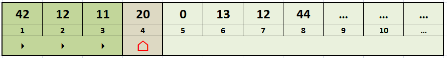
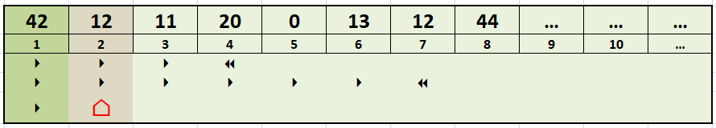
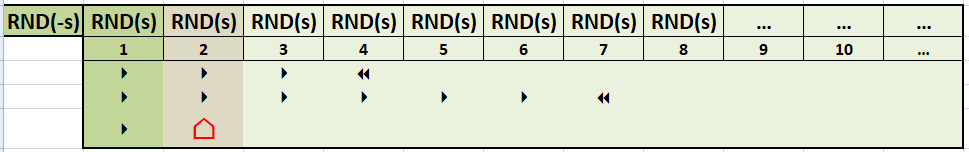

# RANDOM TAPE

## WHAT IS A "RANDOM TAPE"?

A **random tape** is an "abstract" memorization device, characterized as an unlimited tape of stored random values. The tape was generated some time in the past, it keeps the random sequence intact and over time and therefore can be used at any time. To access to this tape is possible by doing a reading in *only one direction*, as follows:

The diagram above shows an example of random tape. It contains a set of sequential random values (**42, 12, 11, 20, 0, 13, ...**). The current reading position is **4**: this implies that, at the next reading, you will receive the number **20** and the current reading position will change to **5**. There is no way to go back to position **3** or less. The only operations granted are:
* **reading the next value**, which will move the cursor forward by one position;
* **rewind the tape**, wich will move the cursors back to position 1.

So you can access and read sequentially the values stored in it. Obviously, it is possible to rewind the tape from the beginning and start reading again, which will always give the same set of random values, in the same order as the first reading. However, it is not possible to go directly to a certain position. Random access is not possible. Clearly, this type of access can be emulated by performing a rewind and reading up to the desired position.

## STANDARD IMPLEMENTATION

The standard implementation of such a device would require unlimited storage space, as well as space to store the current position reached. For example, if you want to represent a value of one byte (0-255) for each value stored, and a tape of at least 200,000 positions long, you will need about 200 KB

## CUSTOM IMPLEMENTATION

A more efficient implementation, in terms of space, is to use the internal random number generator, the one integrated into the target language / environment, as direct implementation of tape's content. 

This is possible because the most widespread implementation of this generator, the [linear congruential generator](https://en.wikipedia.org/wiki/Linear_congruential_generator), has the ability to produce the same sequence of random numbers with the same seed number (**s**).

The implementation on Commodore computers is to expose a function (<code>RND</code>) that accepts a numeric parameter such as "seed". The behavior of this function varies with this seed:

* **if seed is < 0**, a new sequence of random numbers is started using the argument;
* **if seed is > 0**, the next random number is returned.

The diagram above shows an example of random tape implemented with the random function (<code>RND(...)</code>). The first call uses the negative seed value to initialize the algorithm (<code>RND(-s)</code>), so that it always generates the same sequence. The sequence is then generated by calling the same function with the positive value of the seed <code>RND(s)</code>.

With this implementation, it is sufficient to have the space to store the seed to have all the information necessary to generate the random tape. The seed can be used as a "tape index", to distinguish tapes.

The implementation that directly uses random values is the best because it allows to "adapt" the width of the data (in terms of bits) according to your needs. However, if the data always had the same size in terms of bits (eg: a binary file of bytes) then it is worth normalizing the output data with the appropriate constant multiplications.

## A READABLE RANDOM TAPE

The following is the implementation of the random tape using BASIC V2 with an output width of 8 bits for each value read. Obviously, there are no particular optimizations or techniques relating to the compression of the sources, and this to improve comprehensibility. This program will read 10 byte values (0..255) from the tape, then rewind the tape and re-read again 10 values, and so on. As you can verify, the values are are always the same. This shows that, although a random number generator is explictly used, the values are effectively stored on the tape and can be read when we need it.

<pre><code>
10 rem ********************************
15 rem *** random tape implementation
20 rem ********************************
25 s=1: REM number of the tape
30 gosub 1000: REM call rewind( )
35 for i=1 to 10
40 gosub 1100: REM call read( ) -> t
45 print t
50 next i
55 gosub 1100: REM call read( ) -> t
60 print t
65 print "---"
70 goto 30
1000 REM rewind( )
1010 t=rnd(-s)
1020 return
1100 REM read( ) -> t
1110 t=int(rnd(s)*256)
1120 return
</code></pre>