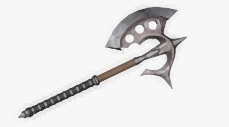
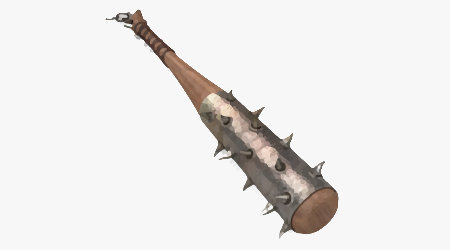
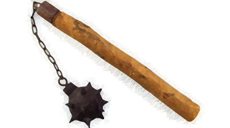
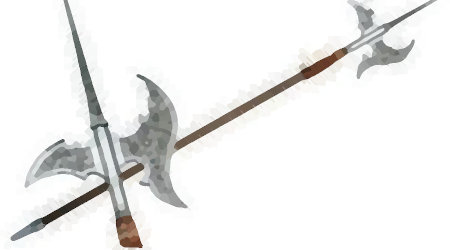
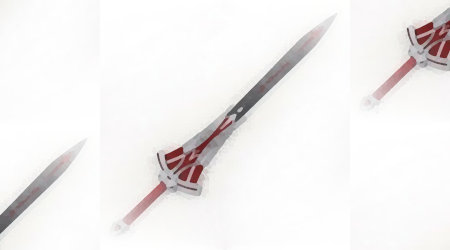

# WEAPONS

To attack you need to have a weapon. If that's a general rule, it's especially true in this game. You cannot attack monsters you encounter without a weapon, and you will be forced to run away. During the exploration of the forest, you will be able to find weapons left by previous characters: however, you can always and only take a weapon. **Once taken, you will not be able to change your weapon.** So choose it well.

## HIT POINTS

Each weapon has a specific ability to damage the opponent. Therefore, when you hit a monster, it reduces its hit points accordingly. In this table you will have a summary of each weapon's ability to damage.

<table>
    <tr>
        <th>
        Weapon 
        </th>
        <th>Maximum damage (HP)</th>
    </tr>
    <tr>
        <td>club</td>
        <td>3</td>
    </tr>
    <tr>
        <td>mace</td>
        <td>6</td>
    </tr>
    <tr>
        <td>sword</td>
        <td>9</td>
    </tr>
    <tr>
        <td>pike</td>
        <td>12</td>
    </tr>
    <tr>
        <td>axe</td>
        <td>15</td>
    </tr>
</table>

## LIST OF AVAILABLE WEAPONS

### AXE

A battle axe (also battle-axe, battle ax, or battle-ax) is an axe specifically designed for combat. Battle axes were specialized versions of utility axes. Many were suitable for use in one hand, while others were larger and were deployed two-handed.

*This article uses material from the Wikipedia article <a href="https://en.wikipedia.org/wiki/Battle_axe">Battle axe</a>, which is released under the <a href="https://creativecommons.org/licenses/by-sa/3.0/">Creative Commons Attribution-Share-Alike License 3.0</a>.*

<table>
    <tr>
        <th>Maximum damage (HP)</th>
    </tr>
    <tr>
        <td>15</td>
    </tr>
</table>

### CLUB

A club (also known as a cudgel, baton, bludgeon, truncheon, cosh, nightstick or impact weapon) is among the simplest of all weapons: a short staff or stick, usually made of wood, wielded as a weapon since prehistoric times. Most clubs are small enough to be swung with one hand, although larger clubs may require the use of two to be effective. Various specialized clubs are used in martial arts and other fields, including the law-enforcement baton. The military mace is a more sophisticated descendant of the club, typically made of metal and featuring a spiked, knobbed, or flanged head attached to a shaft.

The wounds inflicted by a club are generally known as strike trauma or blunt-force trauma injuries.

*This article uses material from the Wikipedia article <a href="https://en.wikipedia.org/wiki/Club_(weapon)">Club (weapon)</a>, which is released under the <a href="https://creativecommons.org/licenses/by-sa/3.0/">Creative Commons Attribution-Share-Alike License 3.0</a>.*

<table>
    <tr>
        <th>Maximum damage (HP)</th>
    </tr>
    <tr>
        <td>3</td>
    </tr>
</table>

### MACE

A mace is a blunt weapon, a type of club or virge that uses a heavy head on the end of a handle to deliver powerful strikes. A mace typically consists of a strong, heavy, wooden or metal shaft, often reinforced with metal, featuring a head made of stone, bone, copper, bronze, iron, or steel.

*This article uses material from the Wikipedia article <a href="https://en.wikipedia.org/wiki/Mace_(bludgeon)">Mace (bludgeon)</a>, which is released under the <a href="https://creativecommons.org/licenses/by-sa/3.0/">Creative Commons Attribution-Share-Alike License 3.0</a>.*

<table>
    <tr>
        <th>Maximum damage (HP)</th>
    </tr>
    <tr>
        <td>6</td>
    </tr>
</table>

### PIKE

A pike is a pole weapon, a very long thrusting spear formerly used extensively by infantry.

*This article uses material from the Wikipedia article <a href="https://en.wikipedia.org/wiki/Mace_(bludgeon)">Mace (bludgeon)</a>, which is released under the <a href="https://creativecommons.org/licenses/by-sa/3.0/">Creative Commons Attribution-Share-Alike License 3.0</a>.*

<table>
    <tr>
        <th>Maximum damage (HP)</th>
    </tr>
    <tr>
        <td>12</td>
    </tr>
</table>

### SWORD

A sword is a bladed melee weapon intended for slashing or thrusting that is longer than a knife or dagger, consisting of a long blade attached to a hilt. The blade can be straight or curved. Thrusting swords have a pointed tip on the blade, and tend to be straighter; slashing swords have a sharpened cutting edge on one or both sides of the blade, and are more likely to be curved. Many swords are designed for both thrusting and slashing.

*This article uses material from the Wikipedia article <a href="https://en.wikipedia.org/wiki/Sword">Sword</a>, which is released under the <a href="https://creativecommons.org/licenses/by-sa/3.0/">Creative Commons Attribution-Share-Alike License 3.0</a>.*

<table>
    <tr>
        <th>Damages (HP)</th>
    </tr>
    <tr>
        <td>9</td>
    </tr>
</table>
